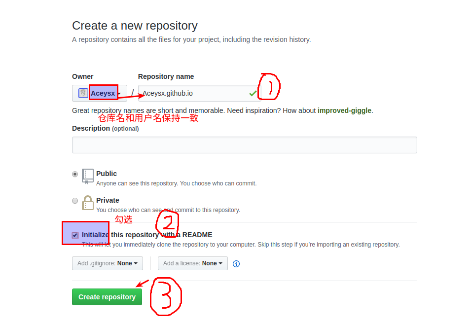
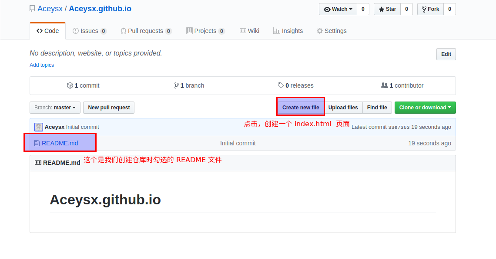
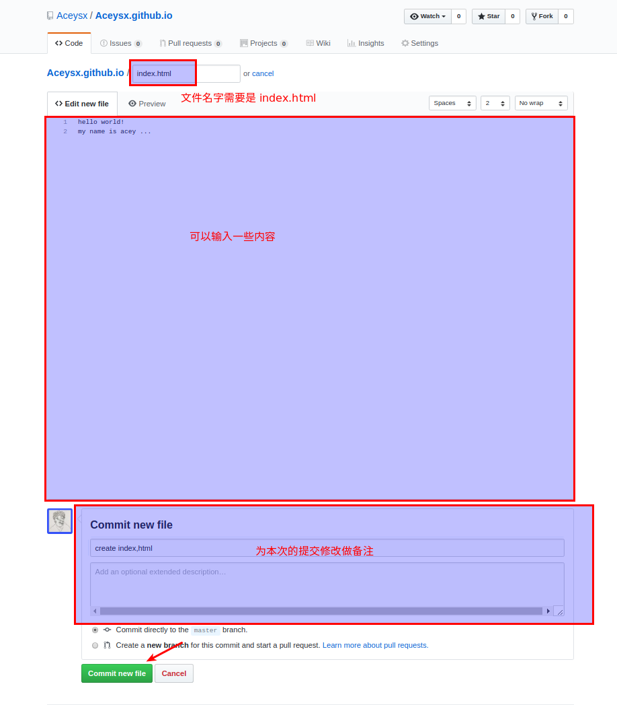
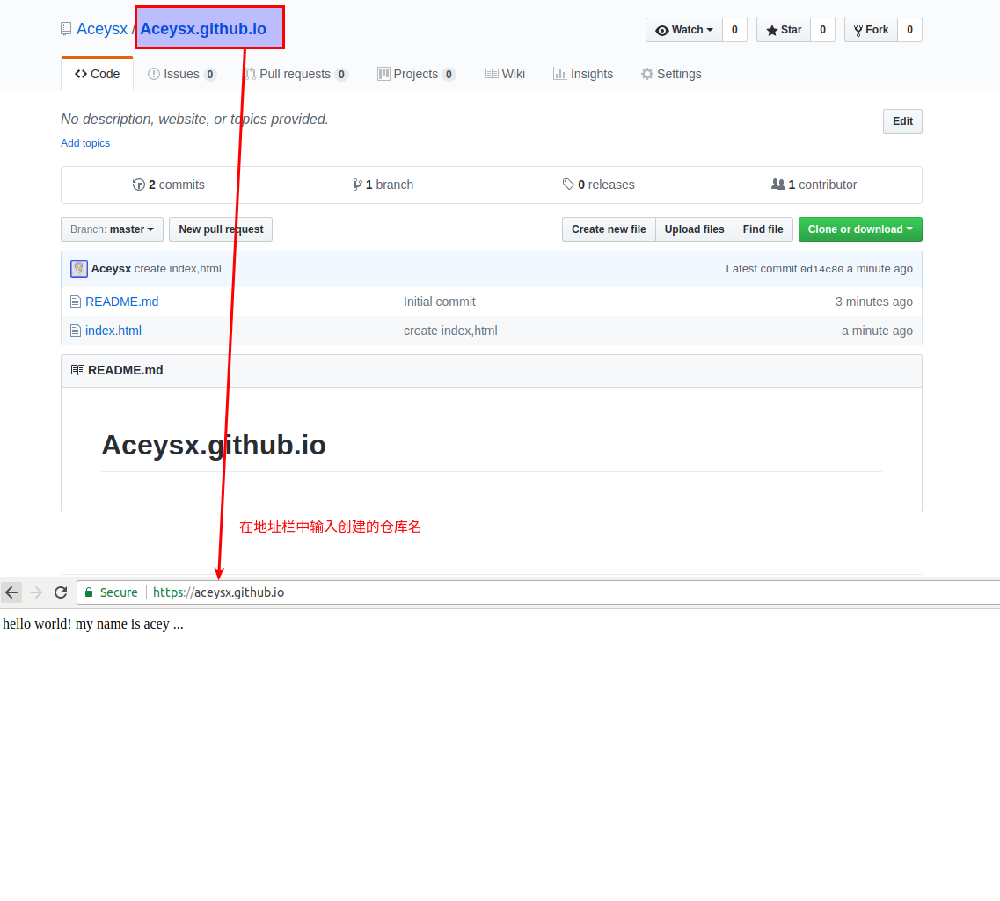

# GitHub Pages

#### 本节学习目标

* 能够使用 GitHub Pages 来搭建自己的静态页面

#### 本节学习内容

观看下面视频了解[GitHub](https://github.com):

<video width="100%" id="video" controls="" preload="auto" poster="">
      <source id="mp4" src="/video/First Look • Collaboration with Git and GitHub.mp4" type="video/mp4">
      
抱歉，你的浏览器不支持在线视频播放。

</video>

那么什么是GitHub Page呢？
1. 什么是 GitHub Pages

> GitHub Pages 是 [GitHub](www.github.com) 的静态页面托管服务。它设计的初衷是为了用户能够直接通过  [GitHub](www.github.com) 仓库来托管用户个人、组织或是项目的专属页面。参考：[What is GitHub Pages?](http://link.zhihu.com/?target=https%3A//help.github.com/articles/what-is-github-pages/)

很多人用它来托管自己的个人博客、个人简历或者是一些 HTML5 的小游戏，这一切都是免费的，但 GitHub  Pages 也有一些 限制

- 仓库存储的所有文件不能超过 1 GB
- 页面的带宽限制是低于每月 100 GB 或是每月 100,000 次请求。
- 每小时最多只能部署 10 个静态网站。

2. 搭建自己的静态网站

**第一步：**创建一个 [GitHub](www.github.com) 账号

**第二步：**创建一个仓库

使用 `username.github.io` 作为仓库名，其中 username 是你 github 的用户名。最后点击 `create repository`

**第三步：**在创建好的仓库中添加一个 index.html 文件

这样一个简单的静态网站就搭建成功了，你可以把网址发给小伙伴，你的小伙伴就可以看到你的网站了。

> 注：第三步的操作也可以使用 Git 来完成

#### 资源与工具

- [如何使用 GitHub](https://www.zhihu.com/question/20070065)
- [GitHub pages 搭建](https://pages.github.com/)
- 廖雪峰的 Git 在线教程：<http://www.liaoxuefeng.com/wiki/0013739516305929606dd18361248578c67b8067c8c017b000>
- Git 的基础内容的学习： <https://try.github.io/>

#### 本节练习
- 先注册一个GitHub账号，在GitHub中新建一个库，尝试`git clone`到本地进行修改，并`git push`上传到Github。
- 编写一个静态页面，上传到自己的 GitHub Pages 中并回复链接地址。

