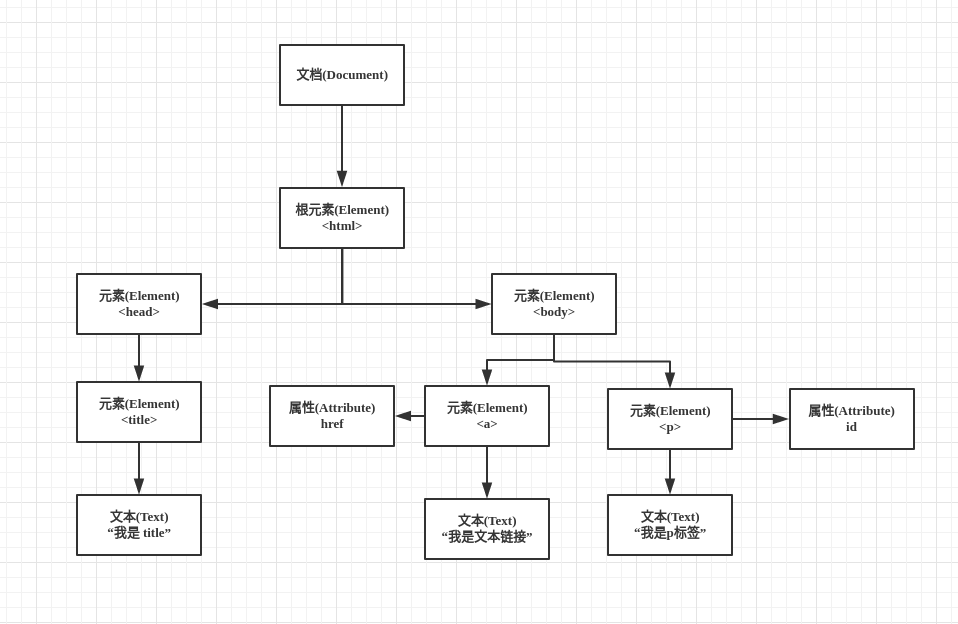

# DOM 介绍

####  本节学习目标

- 了解DOM基础
- 使用 DOM 对 web 页面元素进行操作


#### 本节内容

> DOM（文档对象模型）是针对 HTML 和 XML 文档的一个 API，通过 DOM 可以去改变文档。

简单的说，一个 web 网页就是一个文档，使用 DOM 改变文档就是使用 DOM 定义的一些方法操作具体的节点。比如用`getElementById` 来根据元素 `id` 来查找元素节点。

当浏览器载入HTML时，会生成相应的 DOM 树，大概长这样




把它转成 HTML 代码的话会是这样

```html
<html lang="en">
  <head>
    <title>我是title</title>
  </head>
  <body>
	<a href="#">我是文本链接</a>
	<p id="myId">我是p标签</p>
  </body>
</html>


```

对于一个 HTML 来说，文档节点 `Document` （是看不到的）就是它的根节点，这个根节点对应的对象就是 `document` ，我们可以通过根节点来访问它的子节点(Element 、Text)。


##### Document 类型

刚才说道  `Document` 是整个文档的根节点，我们想要访问某个节点的时候都必须通过 `document` 这个实例对象。

`document` 对象的常用属性：

```javascript
document.documentElement  // 可以直接拿到 html 节点的引用
document.title //  可以直接获取 title 节点的文本 “我是title”
document.URL // 获取 URL
```

`document` 对象的常用方法

```javascript
document.getElementById // docment.getElementById('myId') 可以获取到属性 id 为 ‘myId’ 的节点，在上面的代码中获取的也就是 p 节点
document.getElementsByTagName //docment.getElementByTagName('p') 可以获取到节点为 p 的所有节点集
```


现在我们就根据 `document` 对象中的方法获取到 HTML 中任意节点了，下面我们来介绍在已经拿到节点的基础上该如何对该节点进行操作。


**Element 类型**

通常我们在使用 `document` 对象来获取节点时，返回的节点类型就是 `Element` 类型，所以我们想要对获取的节点进行操作，我们只需要使用 `Element` 包含的属性和方法即可。

常用的属性：

```javascript
var myNode = document.getElementById('myId');
myNode.id // 获取该节点的 id ，即 ‘myId‘
myNode.tagName // 获取该节点的节点名，即 'P'，大部分浏览器返回的标签名都是大写
myNode.className //获取该节点的 class
```

操作节点属性的常用方法：

```JavaScript
//假如我们有一个 input，我们想要获取 input 的 type 属性，并对 type 属性进行操作
<input type='text' id='input'/>
  
var myNode = document.getElementById('input')
myNode.getAttribute('type') // 获取属性值，即 ‘text’
myNode.setAttribute('type','password') // 将 type 属性值改为 password 类型
myNode.removeAttribute('type') // 移除 type 属性
```


#### 其他资料推荐

- DOM 事件：http://www.w3school.com.cn/htmldom/dom_events.asp

#### 本节练习

编写一个模拟用户登录的功能，正确的账号密码均为123，页面需要两个 `input` 节点和一个 `button` 节点。

要求：

- 点击 `button` 时需要判断用户输入的账号密码是否为 123 ，并给予相应的提示（方式不限）
- 如果账号或密码错误，将密码所在的 `input` 节点中的内容清空
